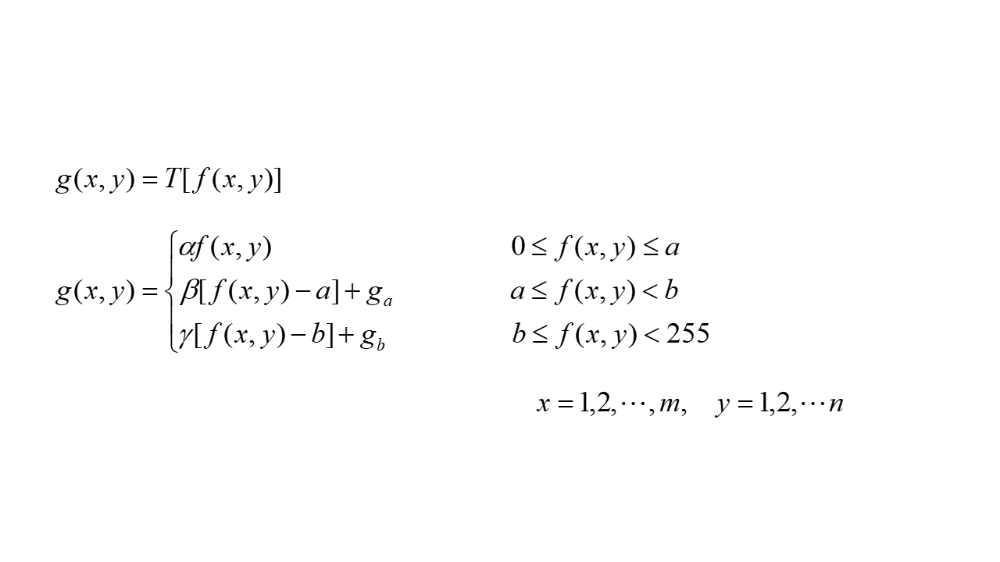
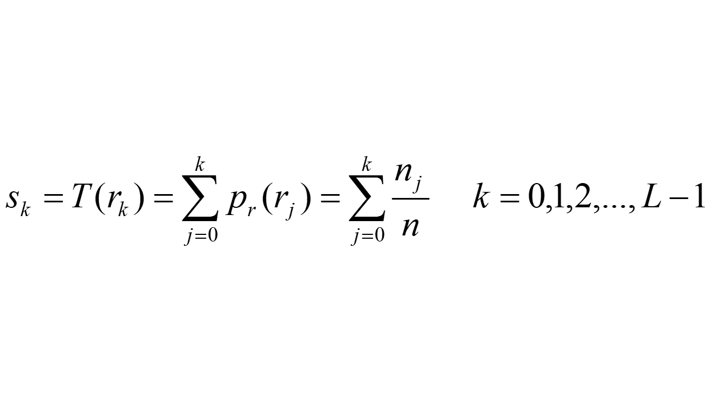

# matlab_image_processing

## 1 灰度线性变换就是将图像中所有点的灰度按照线性灰度变换函数进行变换。

## 2 直方图均衡化通过点运算将输入图像转换为在每一级上都有相等像素点数的输出图像。按照图像概率密度函数PDF的定义：

### 通过转换公式获得：


## 多种灰度变换方法分别各选取一个合适的图像进行处理，记录灰度变换前后的图像、直方图以及相关参数。
### （1）灰度反转
### （2）对数变换
### （3）伽马校正
### （4）分段线性变换
### （5）直方图均衡化

## 3 图像的锐化与边缘提取
### 1 频率提升——将原图像与边缘信息加权；
### 2 高频增强——改变滤波模板直接实现边缘增强；
### 3 一阶算子具备梯度方向信息，但是对丰富的高频纹理信息不敏感，适合于需要对边缘后续处理的应用；
### 4 二阶算子对高频纹理信息敏感，但是无法获得边缘的梯度信息，适合于仅需要边缘位置信息的应用

### Sobel算子，Roberts算子，Laplace算子和Canny算子运算提取边缘
```
img=imread('test.bmp');% 提取图像 
figure;imshow(img);
img_0=rgb2gray(img);%  彩色图像灰度化
img_1=edge(img_0,'sobel'); %用SOBEL算子进行边缘检测 
img_2=edge(img_0,'roberts');%用Roberts算子进行边缘检测 
img_3=edge(img_0,'log'); %用log算子进行边缘检测 
img_4=edge(img_0,'canny'); %用canny算子进行边缘检测 
figure;
subplot(221);imshow(img_1);title('SOBEL算子进行边缘检测');
subplot(222);imshow(img_2);title('用Roberts算子进行边缘检测');
subplot(223);imshow(img_3);title('用log算子进行边缘检测');
subplot(224);imshow(img_4);title('用canny算子进行边缘检测');
```

### sobel算子
```
img=imread('test.bmp');
img_1=fspecial('sobel');
img_d=im2double(img);%将f转换为归一化的double类图像
img_r_1=imfilter(img_d,img_1,'replicate');%图像大小通过复制外边界的值来扩展
img_jia_1=img_d-img_r_1;img_jian_1=img_d+img_r_1;%sobel算子模板
figure;
imshow(img);title('原始图像');
figure;
subplot(121);imshow(img_jia_1);title('sobel算子边缘相加');
subplot(122);imshow(img_jian_1);title('sobel算子边缘相减');
```

### prewitt算子
```
img=imread('test.bmp');
img_2=fspecial('prewitt' );
img_d=im2double(img);%将f转换为归一化的double类图像
img_r_2=imfilter(img_d,img_2,'replicate');%图像大小通过复制外边界的值来扩展
img_jia_2=img_d-img_r_2;img_jian_2=img_d+img_r_2;%prewitt算子模板
figure;
imshow(img);title('原始图像');
figure;
subplot(121);imshow(img_jia_2);title('prewitt算子边缘相加');
subplot(122);imshow(img_jian_2);title('prewitt算子边缘相减');
```

### laplacian算子
```
img=imread('test.bmp');
img_3=fspecial('laplacian',0);
img_d=im2double(img);%将f转换为归一化的double类图像
img_r_3=imfilter(img_d,img_3,'replicate');%图像大小通过复制外边界的值来扩展
img_jia_3=img_d-img_r_3;img_jian_3=img_d+img_r_3;%laplacian算子模板
figure;
imshow(img);title('原始图像');
figure;
subplot(121);imshow(img_jia_3);title('laplacian算子边缘相加');
subplot(122);imshow(img_jian_3);title('laplacian算子边缘相减');
```

## 4 基于形态学的图像分割
### 击中或击不中变换
```
img=imread('cameraman.jpg');%读取原始图像
[a,b]=imread('cameraman.jpg');%读取原始图像转换为二值图像
img_double=im2bw(a,b,0.5);
se_1= [0 1 0
      1 1 1
      0 1 0]; 
se_2= [0  1  1 0 0
       0  1  1 0 0
       0  1  1 0 0
       0  1  1 0 0
       0  1  1 0 0];

img_1=bwhitmiss(img_double,se_1);%se_1击中/击不中变换
img_2=bwhitmiss(img_double,se_2);%se_2击中/击不中变换
subplot(221);imshow(img);title('原始图像');
subplot(222);imshow(img_double);title('二值图像');
subplot(223);imshow(img_1);title('se_1击中/击不中变换');
subplot(224);imshow(img_2);title('se_2击中/击不中变换');
```

### 简单二值图像分别进行膨胀与腐蚀
```
img=imread('outline.tif');%读取原始图像
se_1= strel('square',3);
se_2= [0 1 0
      1 1 1
      0 1 0]; 
se_3= [0  1  1 0 0
       0  1  1 0 0
       0  1  1 0 0
       0  1  1 0 0
       0  1  1 0 0];
%如果图像为彩色图像可先转换为灰度图像img_r=rgb2gray(img);%转换为灰度图像
img_1=imdilate(img,se_1);%膨胀处理
img_2=imerode(img,se_1);%腐蚀处理
subplot(331);imshow(img);title('原始图像');
subplot(332);imshow(img_1);title('se_1膨胀处理图像');
subplot(333);imshow(img_2);title('se_1腐蚀处理图像');
img_3=imdilate(img,se_2);%膨胀处理
img_4=imerode(img,se_2);%腐蚀处理
subplot(334);imshow(img);title('原始图像');
subplot(335);imshow(img_3);title('se_2膨胀处理图像');
subplot(336);imshow(img_4);title('se_2腐蚀处理图像');
img_5=imdilate(img,se_3);%se_3膨胀处理
img_6=imerode(img,se_3);%se_3腐蚀处理
subplot(337);imshow(img);title('原始图像');
subplot(338);imshow(img_5);title('se_3膨胀处理图像');
subplot(339);imshow(img_6);title('se_3腐蚀处理图像');
```

### 开、闭运算
```
img=imread('cameraman.jpg');%读取原始图像
se_1=strel('square',3);
se_2=strel('disk',5);
subplot(231);imshow(img);title('原始图像');
img_w=im2bw(img,graythresh(img));%二值化处理
subplot(232);imshow(img_w);title('二值处理的图像');
img_1=imopen(img_w,se_1);%开运算
subplot(233);imshow(img_1);title('se_1开运算');
img_2=imclose(img_w,se_1);%闭运算
subplot(234);imshow(img_2);title('se_1闭运算');
img_3=imopen(img_w,se_2);%开运算
subplot(235);imshow(img_1);title('se_2开运算');
img_4=imclose(img_w,se_2);%闭运算
subplot(236);imshow(img_2);title('se_2闭运算');
```

### 去噪与填充
```
img=imread('noisy_rectangle.tif');%原始图像
img_1=im2bw(img);%二值化
img_2=imfill(img_1,'holes');%填充图像
img_3=bwareaopen(img_2,5000);%从图像中移除小目标
subplot(221);imshow(img);title('原始图像');
subplot(222);imshow(img_1);title('二值化图像');
subplot(223);imshow(img_2);title('填充图像');
subplot(224);imshow(img_3);title('从图像中移除小目标');
```

### 细化与骨架抽取
```
BW=imread('text.tif');
level=graythresh(BW);
img=im2bw(BW,level);
BW1 = bwmorph(BW,'thin',Inf);
BW2 = bwmorph(BW,'skel',Inf);
subplot(221);imshow(BW);title('原始图像');
subplot(222);imshow(img);title('二值图像');
subplot(223);imshow(BW1);title('骨架提取');
subplot(224);imshow(BW2);title('减薄图像');
```


